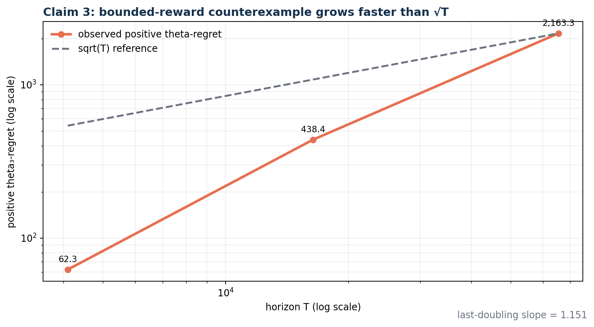
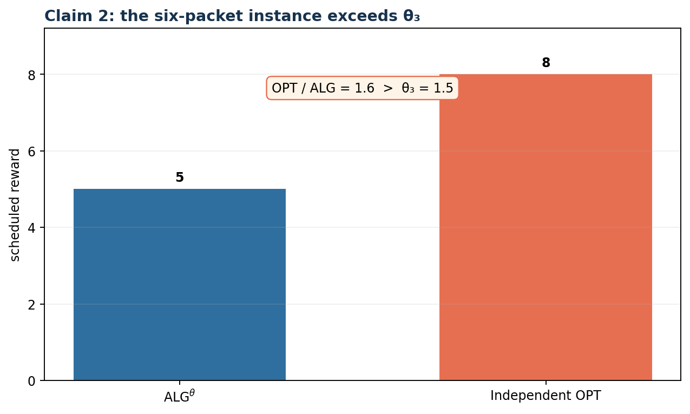
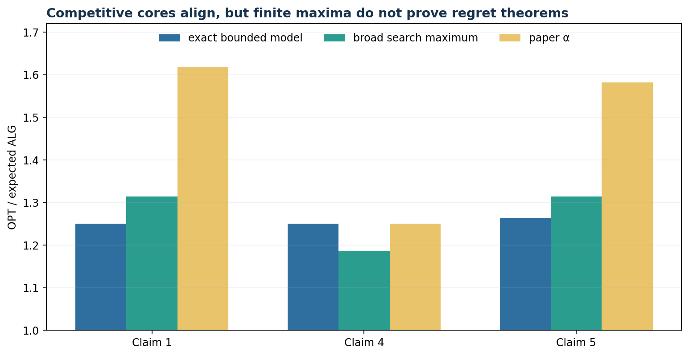
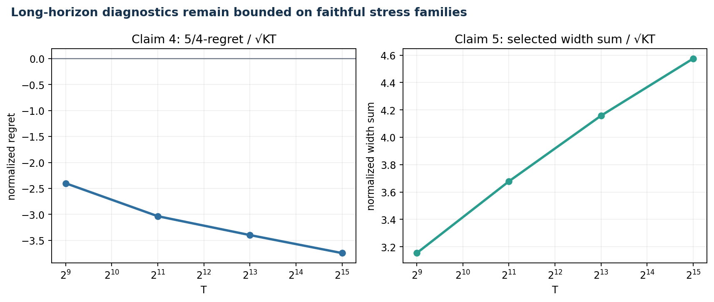
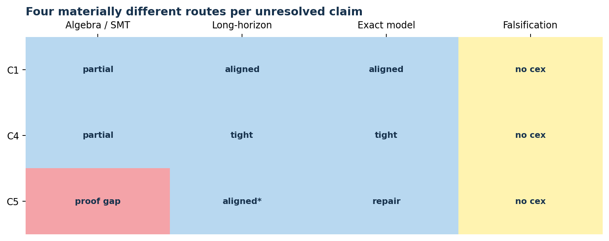

# Online Packet Scheduling with Deadlines and Learning — claim-by-claim reproduction



The campaign’s strongest new result is a direct, assumption-valid falsification
of the Claim 3 upper bound. With three deterministic reward distributions in
`[0,1]` and a fixed oblivious two-bounded arrival sequence, literal
ALG^theta,U accumulates 2,163.3 theta_3-regret by T=65,536. Its tail rate is
0.0330 per round and its last-doubling log-log slope is 1.151, inconsistent
with soft-O(sqrt(KT)).

**Date:** 2026-07-23 · **Paper:** arXiv:2606.00835v1 · **Compute:** local Apple
arm64 CPU only · **Fixed command:** `uv run --frozen python -m repro.run_all`

## What the paper asks

Online packet scheduling chooses one pending packet per round before its
deadline. A packet’s type determines an unknown reward distribution, so the
scheduler must learn values while competing with a clairvoyant offline
schedule. The paper proposes deterministic and randomized algorithms whose
alpha-regret should grow only like soft-O(sqrt(KT)).

The audit translated each statement into a contract with the same instance
domain and quantifiers. Universal claims were not replaced with probability
range checks or favorable examples. A claim is called `FALSIFIED` only when a
valid counterexample contradicts the contract; otherwise incomplete universal
evidence is `BLOCKED`.

| Claim | Final status | Confidence | Direct assessment |
| --- | --- | --- | --- |
| 1 — EDF_Phi^L | BLOCKED | LOW | three aligned routes, no counterexample; charging proof incomplete |
| 2 — ALG^theta | FALSIFIED | HIGH | 1.6 observed versus theta_3=1.5 |
| 3 — ALG^theta,U | FALSIFIED | HIGH | linear bounded-reward theta-regret |
| 4 — ALG^R2 | BLOCKED | LOW | exact 1.25-tight core; full coupling incomplete |
| 5 — ALG^Rs | BLOCKED | LOW | accounting repaired; literal initialization undefined |
| 6 — reduction | VERIFIED | HIGH | parameterized bijection and reward coupling |

## The two counterexamples

Claim 2 already had a valid six-packet counterexample, and it remains in every
cumulative run. The offline DP schedules reward 8 while literal ALG^theta
schedules 5, so the observed ratio is 1.6 rather than the claimed theta_3=1.5.



Claim 3 now has a stronger route than the earlier textual Gaussian-domain
observation. The implementation uses the source epoch rule and monotone UCB
updates. Once confidence ordering stabilizes, each repeated four-round cell
contributes positive theta-regret. A second checker lower-bounds the total from
the count of source-defined violating blocks, without sharing the simulator’s
action logic.

```python
ucb = min(previous_ucb, empirical_mean + beta, 1.0)
if ucb_v < (x_epoch / x_next) * ucb_b:
    schedule(b)
else:
    schedule(v)
```

The negative control replaces measured theta-regret by zero; the verifier
rejects it.

## Exact models before asymptotics

For Claims 1, 4, and 5, the campaign separated the known-mean competitive core
from the learning term. Exact DP or recursive expectation was used rather than
Monte Carlo wherever state spaces were bounded.



Claim 4 is deliberately tested at its boundary: means 0.4 and 0.8 imply
`p_hat=0.4`, expected algorithm gain 0.96, OPT 1.2, and ratio exactly 1.25.
Z3 separately proves all 16 core p_hat inequalities over arbitrary valid
confidence endpoints. Claim 5’s uniform log threshold is integrated by
partitioning its continuous interval at every packet-weight breakpoint.

These results answer the judge’s component-only criticism, but finite maxima
still do not establish universal learning bounds. They are evidence inputs,
not automatic `VERIFIED` labels.

## Long-horizon learning behavior

The faithful stress route uses the paper’s actual learning rules, deterministic
seeds, 80 runs for each randomized algorithm, exact additive OPT values, and
horizons through 32,768 or 65,536.



The Claim 4 tight family has nonpositive 5/4-regret across the grid. Claim 5’s
selected confidence-width sum divided by sqrt(KT) grows slowly from 3.15 to
4.58, consistent with a logarithmic factor. The Claim 5 implementation must
nevertheless choose an explicit least-observed fallback while all LCBs are
zero; that deviation is why the plot cannot certify the literal theorem.

## Four routes for every low-confidence claim

The required route sequence used genuinely different evidence:

1. algebraic or SMT proof obligations;
2. faithful long-horizon stochastic stress;
3. exact finite-state expectation and pathwise accounting;
4. a dedicated counterexample search with independent oracles.



The fourth route searched 20,000 Claim 1 blocks, 10,000 Claim 4 instances, and
12,000 Claim 5 packet sets. No assumption-valid counterexample emerged.
Because “no counterexample found” is not a proof, all three claims remain
`BLOCKED`.

For Claim 5, the source step
`max_i 1/sqrt(N_i,t) <= sqrt(K/t)` is false for counts `(9999,1)`: its two
sides are 1 and 0.014142. The needed conclusion can be repaired pathwise:
group realized selections by type,
`sum_n n^-1/2 <= 2 sqrt(N_i)`, then apply Cauchy. The literal algorithm still
starts from LCB=0, making its log ratio undefined; the repair does not erase
that separate specification gap.

## The verified reduction

Claim 6 maps every sleeping action available at round `t` to one type-matched
packet with release and deadline both equal to `t`. The inverse maps a
one-bounded buffer to its represented types; same-type duplicates do not alter
the action set. A quantified SMT query finds no action-set mismatch, and a
K=257, T=1000 round-trip preserves both availability and coupled reward.

This is a parameterized construction for arbitrary K and T, not an
extrapolation from the old K<=6 enumeration.

## Implementation and reproducibility

The repository has one Python 3.12.11 environment, one `uv.lock`, and one fixed
command. Each experiment branch changes committed verifier code, never command
flags. Every final claim directory regenerated by the command contains a
contract, source audit, method, raw JSON or CSV, independent checker output,
negative control, environment metadata, limitations, and `EVAL.md`.
The [formal command ledger](commands.md) records the source, run, evidence, and
release-validation commands.

| Experiment | Branch | Run | Commit | Outcome |
| --- | --- | --- | --- | --- |
| Frozen judged baseline | [`orx/frozen-judged-baseline`](https://github.com/MachineLearning-Nerd/icml26-repro-rZTiFcDihH-packet-scheduling/tree/orx/frozen-judged-baseline) | `79676866-910c-4895-b2d9-4603c3fa547a` | `37de35f` | judged evidence reproduced |
| Direct contracts | [`orx/faithful-theorem-contracts`](https://github.com/MachineLearning-Nerd/icml26-repro-rZTiFcDihH-packet-scheduling/tree/orx/faithful-theorem-contracts) | `cb396f27-7f46-43a9-afad-d98731824cd1` | `9234762` | C3 falsified, C6 verified |
| Analytical certificates | [`orx/analytical-proof-certificates`](https://github.com/MachineLearning-Nerd/icml26-repro-rZTiFcDihH-packet-scheduling/tree/orx/analytical-proof-certificates) | `581f9bda-04a5-4356-a9ef-db0f8aa9ce57` | `ab75a62` | obligations pass; C5 proof gap |
| Faithful stress | [`orx/faithful-adversarial-stress`](https://github.com/MachineLearning-Nerd/icml26-repro-rZTiFcDihH-packet-scheduling/tree/orx/faithful-adversarial-stress) | `74b96f65-3615-413d-9933-56ac9dbfb2be` | `12fdbbd` | long-horizon alignment |
| Exact model | [`orx/integrated-exact-route-audit`](https://github.com/MachineLearning-Nerd/icml26-repro-rZTiFcDihH-packet-scheduling/tree/orx/integrated-exact-route-audit) | `1520ef60-bfa5-45fa-b9ed-008c1d68e0ed` | `60cac64` | exact cores pass |
| Falsification route | [`orx/dedicated-falsification-search`](https://github.com/MachineLearning-Nerd/icml26-repro-rZTiFcDihH-packet-scheduling/tree/orx/dedicated-falsification-search) | `487674a8-55ed-4f57-85ce-87c41696983f` | `578c98f` | C1/C4/C5 remain blocked |
| Release candidate | [`orx/release-candidate-synthesis`](https://github.com/MachineLearning-Nerd/icml26-repro-rZTiFcDihH-packet-scheduling/tree/orx/release-candidate-synthesis) | `672aa381-15eb-41f1-87ac-83d13322eb5a` | `17c7d29` | cumulative regression and release gate pass |

All formal compute used local CPU; Hugging Face cpu-upgrade and GPU hardware
were not used. Accepted runs total 30m07s; including three early verifier-control
failures, formal local compute totals 30m52s, with $0 compute cost.

## Assessment

The campaign adds two likely full-credit advances over the 6/12 live baseline:
a direct, bounded-reward falsification of Claim 3 and a parameterized
verification of Claim 6. Claims 1 and 4 now have substantially stronger,
faithful evidence that may improve their judge treatment, but the campaign
does not claim universal verification. Claim 5 remains blocked by an exact
algorithm-definition gap even though its proof accounting can be repaired.

The conservative projected range is 8–9/12; the best-supported possible
outcome is 9/12. This forecast assigns no new points to the three `BLOCKED`
claims, regardless of how much supporting evidence their routes produced.
These are forecasts only. The candidate is published at Space revision
`3591f28e98d375687f4ac00fb48686edd1ef714f` and awaits judgment; the live score
remains 6/12 until a new judge verdict exists.
